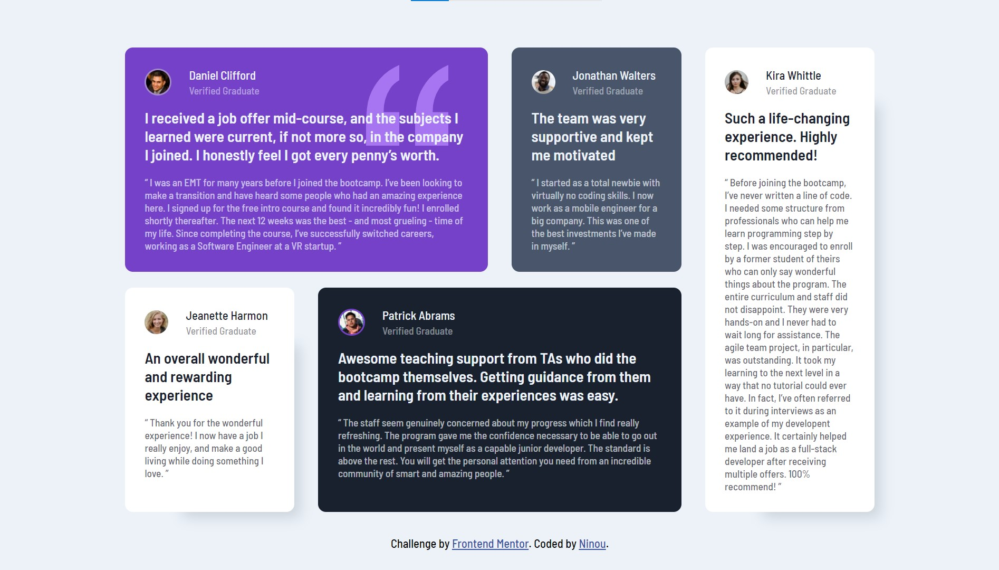

# Frontend Mentor - Testimonials grid section solution

This is a solution to the [Testimonials grid section challenge on Frontend Mentor](https://www.frontendmentor.io/challenges/testimonials-grid-section-Nnw6J7Un7). Frontend Mentor challenges help you improve your coding skills by building realistic projects. 

## Table of contents

- [Overview](#overview)
  - [The challenge](#the-challenge)
  - [Screenshot](#screenshot)
  - [Links](#links)
- [My process](#my-process)
  - [Built with](#built-with)
  - [What I learned](#what-i-learned)
  - [Continued development](#continued-development)
- [Author](#author)

**Note: Delete this note and update the table of contents based on what sections you keep.**

## Overview

### The challenge

Users should be able to:

- View the optimal layout for the site depending on their device's screen size

### Screenshot

### Links

- Solution URL: [Add solution URL here](https://bit.ly/2VB1Gqw
- Live Site URL: [Add live site URL here](https://bit.ly/3npelsd)

## My process

### Built with

- Semantic HTML5 markup
- CSS custom properties
- Flexbox
- CSS Grid
- Mobile-first workflow

### What I learned

I've learned how to better use css grid + how to use flexbox inside css grid

### Continued development

I'm not satisfied whith result if we comparete to the original design and I couldn't figure out what is the problem with my work, so I hope in the future I'll be better in understanding the design to give the best result as code

## Author

- Frontend Mentor - [@Ninou01](https://www.frontendmentor.io/profile/Ninou01)
